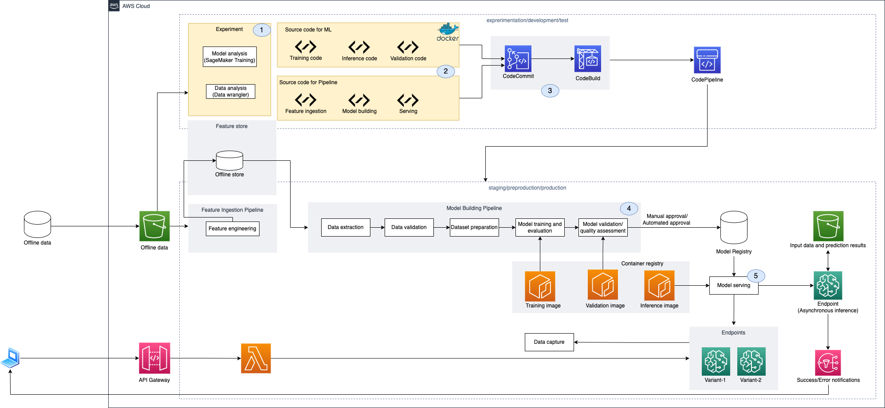
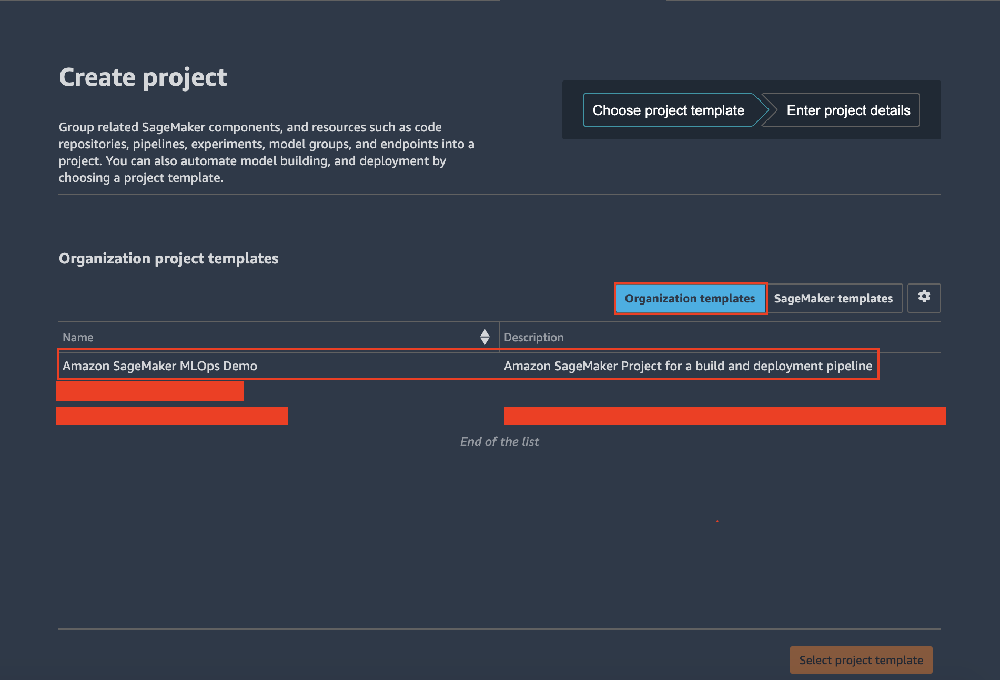
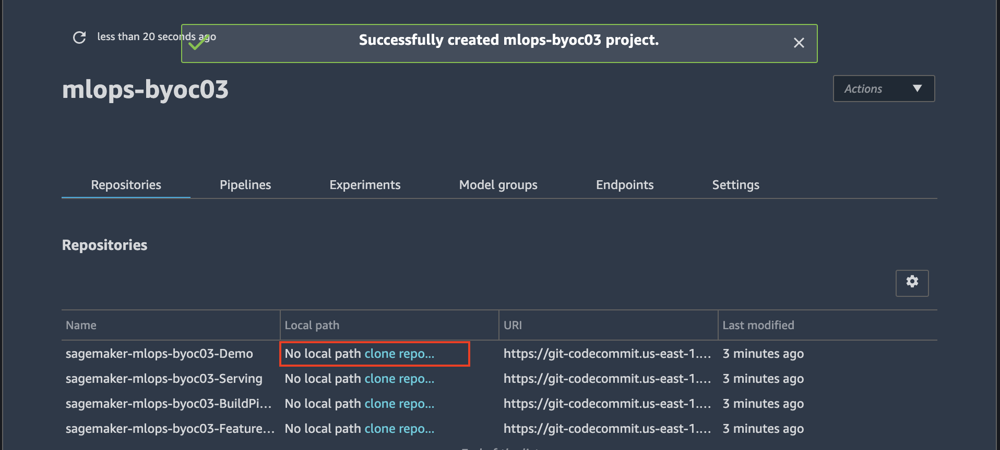

# Bring your own container to MLOps with SageMaker Project

In this project, we demonstrate how to bring your own container to MLOps(machine learning operations) with [SageMaker Project](https://docs.aws.amazon.com/sagemaker/latest/dg/sagemaker-projects-whatis.html) by using the library of text classification task from [Hugging Face](https://huggingface.co/) ecosystem. Besides ML pipeline automation with SageMaker Pipelines, we also use [AWS CDK](https://docs.aws.amazon.com/cdk/v2/guide/home.html) to implement CI/CD with [AWS CodePipeline](https://docs.aws.amazon.com/codepipeline/latest/userguide/welcome.html).

## Overview
<div></div>

### Region
By default, we use the region of `us-east-1`. If you perfer other region, you can modify the following code in `infra/cicd_construct.py`. More regions and corresponding accounts can be found in [Available Deep Learning Containers Images](https://github.com/aws/deep-learning-containers/blob/master/available_images.md).
```python
deploy_spec = codebuild.BuildSpec.from_object(
    dict(
        version="0.2",
        phases=dict(
            install={
                "runtime-versions": {
                    "nodejs": "12",
                },
                "commands": [
                    "npm install -g aws-cdk@latest",
                ],
            },
            build=dict(
                commands=[
                    #login_cli_cmd(cdk.Aws.REGION),
                    "aws ecr get-login-password --region us-east-1 | docker login --username AWS --password-stdin 763104351884.dkr.ecr.us-east-1.amazonaws.com",# Setup your preferable region: {account_id}.dkr.ecr.{region}.amazonaws.com
                    "cdk -a . deploy --all --require-approval=never --verbose",
                ]
            ),
        ),
    )
)
```

Meanwhile in the `repos/build_pipeline/containers/batch_transform/Dockerfile`, `repos/build_pipeline/containers/training/Dockerfile` and `repos/build_pipeline/containers/serving/Dockerfile`, correspondingly you need to modify `account` and `region`.

```bash
FROM {account}.dkr.ecr.{region}.amazonaws.com/huggingface-tensorflow-training:2.5.1-transformers4.12.3-gpu-py37-cu112-ubuntu18.04

COPY resources/train.py /opt/program/train.py

ENV SAGEMAKER_PROGRAM /opt/program/train.py
```

## Solution
- [Amazon SageMaker Feature Store](https://aws.amazon.com/sagemaker/feature-store/) is often used in storing features of structured data. In this solution, we store labeled data of text classification in Amazon SageMaker Feature Store.
- When using the custom algorithms or the state-of-the-art algorithms in a machine learning project, custom containers need to be provided. This solution demonstrates how to bring your own container to MLOps with CI/CD. You can refer to [End to End Pipeline: Bring your own container to SageMaker Pipelines](https://github.com/aws-samples/aws-sagemaker-byoc-end2end) to learn how to implement ML pipeline for BYOC with [SageMaker Pipelines](https://aws.amazon.com/sagemaker/pipelines/) and [AWS SDK](https://boto3.amazonaws.com/v1/documentation/api/latest/guide/quickstart.html).
- [Amazon SageMaker Asynchronous Inference](https://docs.aws.amazon.com/sagemaker/latest/dg/async-inference.html) is a new capability in SageMaker that queues incoming requests and processes them asynchronously. We deploy the asynchronous inference endpoint in model serving phase.

## Setup
### CDK environment
We can follow [Operationalize a Machine Learning model with Amazon SageMaker Featurestore and Amazon SageMaker DataWrangler Using CDK](https://github.com/aws-samples/amazon-sagemaker-mlops-with-featurestore-and-datawrangler) to set up the CDK development environment.

### Build and run a SageMaker project
Once running `cdk deploy` in CDK environment successfully, a SageMaker template will be generated in `AWS Service Catalog`. we can create a SageMaker project from the SageMaker project template.

<div align="center"></div>

We can clone the demo repository from repositories on the `Sagemaker project console` after creating SageMaker project.

<div align="center"></div>

Next step, run the script `walkthrough.ipynb` in the repository `sagemaker-{project-name}-demo` step by step.

## Security

See [CONTRIBUTING](CONTRIBUTING.md#security-issue-notifications) for more information.

## License

This library is licensed under the MIT-0 License. See the [LICENSE](LICENSE) file.
